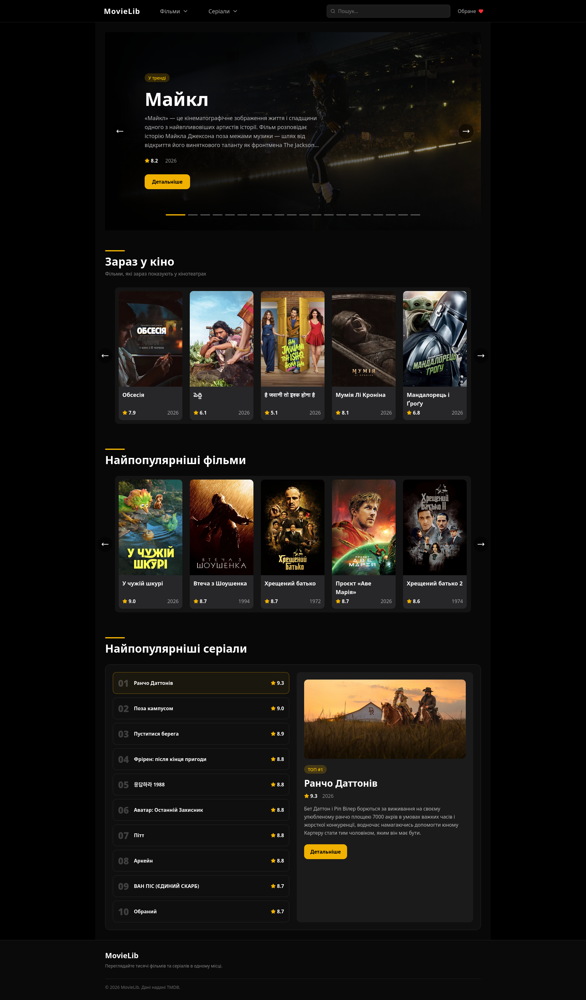
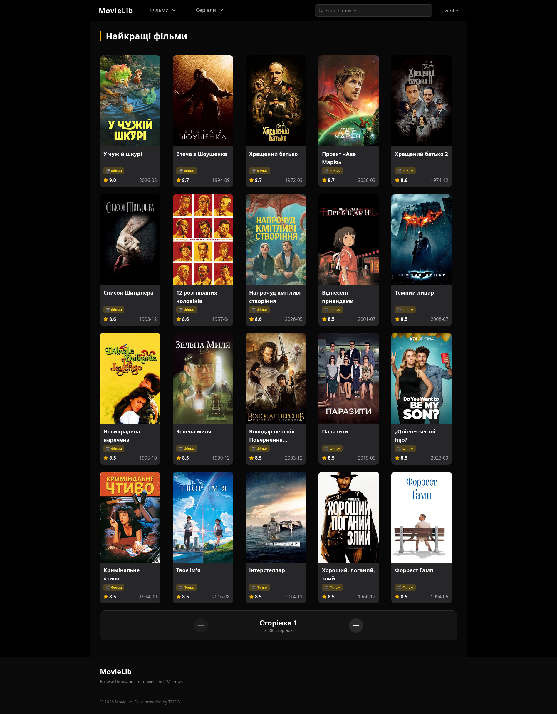
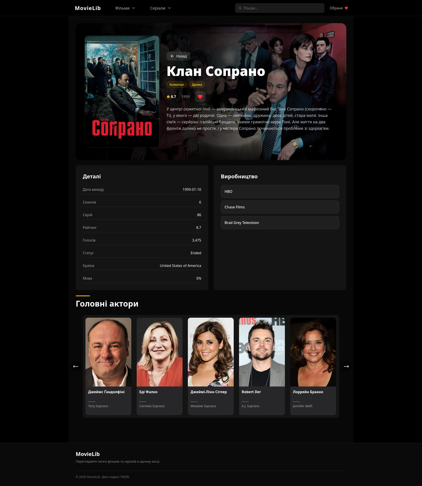
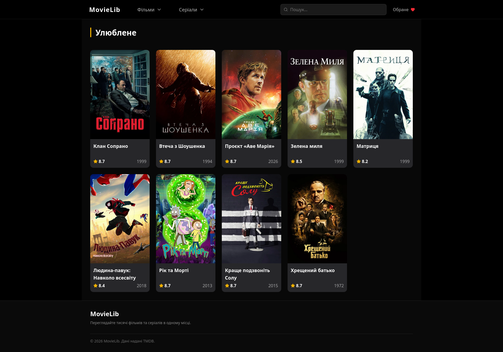

# MovieLib

MovieLib is a movie and TV show discovery platform built with React, TypeScript and TMDB API.

The application allows users to browse popular and top-rated movies and TV shows, search for specific titles, view detailed information and manage a personal favorites collection.

## Preview

### Home Page

Main page featuring an animated hero section built with Motion, horizontal movie and TV show sliders, and a Top 10 TV Shows section.



### Media Catalog

Browse popular and top-rated movies and TV shows with URL-based pagination and responsive media cards.



### Details Page

Detailed information page for movies and TV shows, including genres, cast members, production companies, ratings, release information and plot overview.



### Favorites

Personal favorites collection with Local Storage persistence. Saved movies and TV shows remain available between browser sessions.



## Features

### Home Page

* Animated hero section built with Framer Motion
* Horizontal movie sliders
* Top 10 highest-rated TV shows section

### Movies & TV Shows

* Popular Movies
* Top Rated Movies
* Popular TV Shows
* Top Rated TV Shows

Each category supports pagination and displays 20 items per page.

### Search System

* Search movies and TV shows by title
* Fast navigation to detailed pages

### Details Pages

Every movie and TV show includes a dedicated details page with:

* Title and poster
* Overview and plot description
* Genres
* User rating
* Release information
* Production companies
* Cast information
* Additional data provided by the TMDB API

### Favorites

* Save movies and TV shows to favorites
* Favorites stored in Local Storage
* Persistent data between sessions

## Architecture Highlights

* Component-based architecture
* Custom React hooks
* Reusable UI components
* Type-safe API integration
* URL-based pagination
* Local Storage persistence
* Dynamic routing with React Router
* Separation of concerns between pages, components, hooks and API layer

## Tech Stack

### Frontend

* React 19
* TypeScript
* Vite
* React Router

### Styling & UI

* Tailwind CSS 4
* Lucide React Icons

### Animations

* Motion (Framer Motion)

### Data & API

* Axios
* TMDB API

### Development Tools

* ESLint
* TypeScript ESLint

## Installation

```bash
git clone https://github.com/nikita-dev17/MovieLib.git
cd MovieLib
npm install
```

## Environment Variables

Create a `.env` file in the project root:

```env
VITE_TMDB_API_KEY=your_api_key
```

## Run Development Server

```bash
npm run dev
```

## Project Goals

This project was created to practice building a larger React application with:

* TypeScript
* API integration
* State management
* Custom hooks
* Component composition
* Routing
* Pagination
* Persistent user data

## Author

Nikita Ivanov